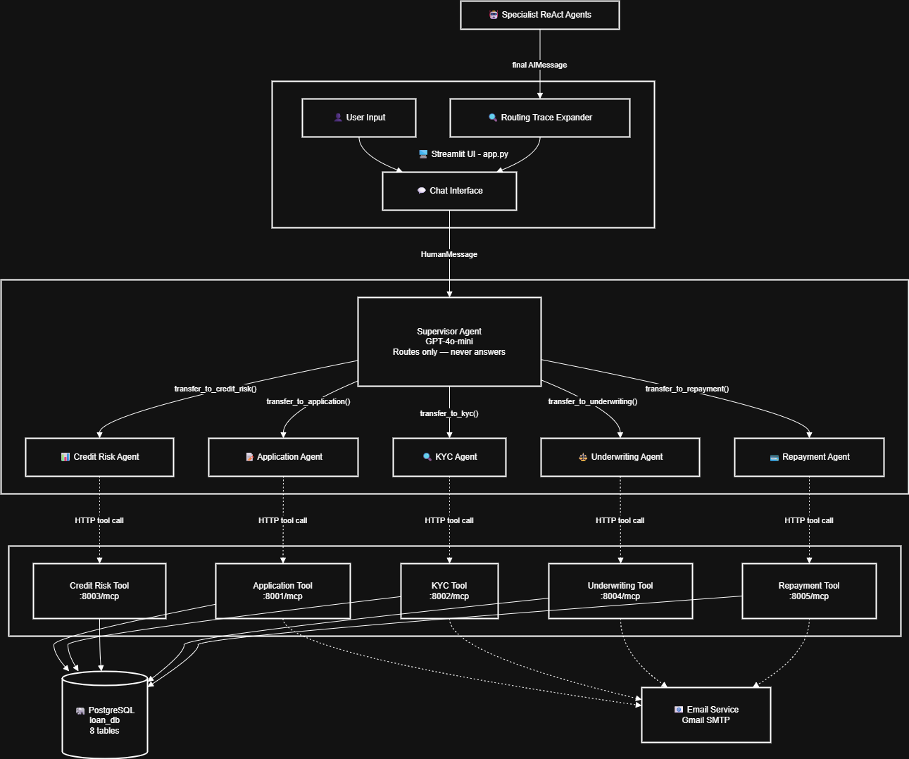
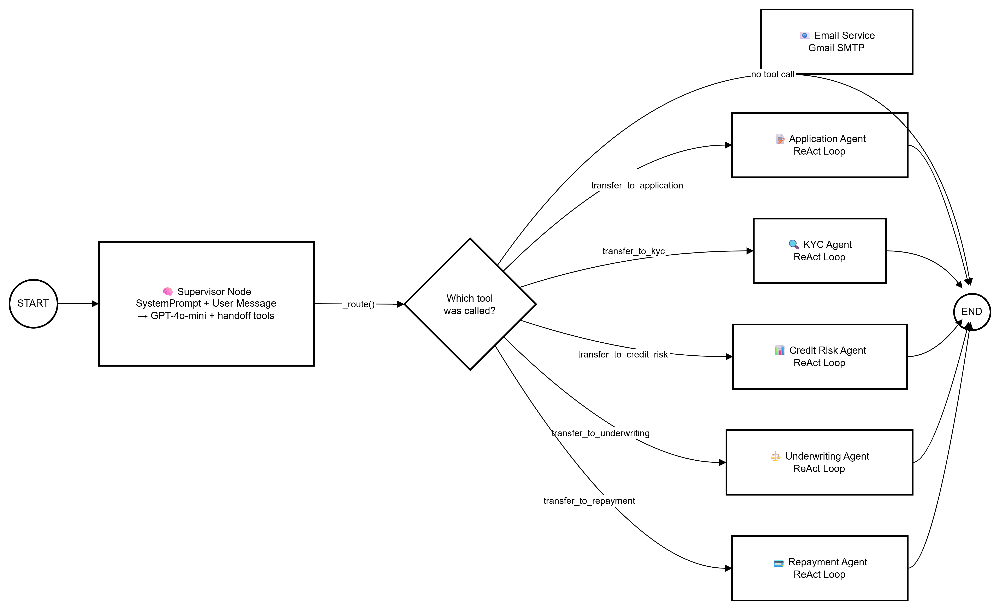

# 🏦 Loan & Credit Multi-Agent System — Complete Code Explanation

> A step-by-step, file-by-file breakdown of how this MCP-powered, LangGraph-supervised, multi-agent loan processing system works.

---

## Table of Contents

1. [System Architecture Overview](#1-system-architecture-overview)
2. [What is MCP (Model Context Protocol)?](#2-what-is-mcp-model-context-protocol)
3. [Project Structure](#3-project-structure)
4. [Environment Setup (`.env`)](#4-environment-setup-env)
5. [Database Layer — `database/db.py`](#5-database-layer--databasedbpy)
6. [Email Service — `utils/email_service.py`](#6-email-service--utilsemail_servicepy)
7. [MCP Servers — Deep Dive](#7-mcp-servers--deep-dive)
   - 7.1 [Application Server (port 8001)](#71-application-server-port-8001)
   - 7.2 [KYC Server (port 8002)](#72-kyc-server-port-8002)
   - 7.3 [Credit Risk Server (port 8003)](#73-credit-risk-server-port-8003)
   - 7.4 [Underwriting Server (port 8004)](#74-underwriting-server-port-8004)
   - 7.5 [Repayment Server (port 8005)](#75-repayment-server-port-8005)
8. [Start Servers Script — `start_servers.py`](#8-start-servers-script--start_serverspy)
9. [Supervisor Graph — `supervisor/graph.py`](#9-supervisor-graph--supervisorgraphpy)
10. [Streamlit UI — `app.py`](#10-streamlit-ui--apppy)
11. [How to Run the Full System](#11-how-to-run-the-full-system)
12. [Complete Request Flow — End-to-End Example](#12-complete-request-flow--end-to-end-example)

---

## 1. System Architecture Overview

```
┌──────────────────────────────────────────────────────────────────┐
│                        STREAMLIT UI (app.py)                     │
│                  User types message / clicks quick action        │
└──────────────────────┬───────────────────────────────────────────┘
                       │ HTTP POST (port 9001)
                       ▼
┌──────────────────────────────────────────────────────────────────┐
│               SUPERVISOR SERVER (supervisor_server.py)           │
│     FastAPI server exposing LangGraph on port 9001               │
│     Decides which specialist agent should handle the task        │
└──────┬──────────┬──────────┬──────────┬──────────┬───────────────┘
       │          │          │          │          │
       ▼          ▼          ▼          ▼          ▼
  ┌────────┐ ┌────────┐ ┌────────┐ ┌────────┐ ┌────────┐
  │  App   │ │  KYC   │ │ Credit │ │ Under- │ │Repay-  │
  │ Agent  │ │ Agent  │ │  Risk  │ │writing │ │ ment   │
  │        │ │        │ │ Agent  │ │ Agent  │ │ Agent  │
  └───┬────┘ └───┬────┘ └───┬────┘ └───┬────┘ └───┬────┘
      │          │          │          │          │
      ▼          ▼          ▼          ▼          ▼
  ┌────────┐ ┌────────┐ ┌────────┐ ┌────────┐ ┌────────┐
  │  MCP   │ │  MCP   │ │  MCP   │ │  MCP   │ │  MCP   │
  │ Server │ │ Server │ │ Server │ │ Server │ │ Server │
  │  8001  │ │  8002  │ │  8003  │ │  8004  │ │  8005  │
  └───┬────┘ └───┬────┘ └───┬────┘ └───┬────┘ └───┬────┘
      │          │          │          │          │
      └──────────┴──────────┴──────────┴──────────┘
                            │
                            ▼
                    ┌──────────────┐
                    │  PostgreSQL  │
                    │   loan_db    │
                    └──────────────┘
```

### 📊 Diagram 1 — High-Level Architecture



### 📊 Diagram 2 — Supervisor Routing Flow



### 📊 Diagram 4 — MCP Communication Protocol


**Key Concepts:**

- **Supervisor Pattern**: One "boss" AI agent (the Supervisor) reads every user message and decides which specialist should handle it. The supervisor never answers the user directly.
- **Specialist Agents**: Five ReAct agents (built with LangGraph's `create_react_agent`), each with access to ONLY its own MCP server tools.
- **MCP Servers**: Five FastMCP HTTP servers, each exposing domain-specific tools as an HTTP API that the LLM can call.
- **Database**: A single PostgreSQL database holds all loan data, shared by all servers.

---

## 2. What is MCP (Model Context Protocol)?

### 2.1 Concept

MCP is a protocol that lets you expose **tools** (functions) to LLMs over a standard transport (HTTP, stdio, SSE). Think of it as a "plugin system" for AI models:

1. **You define Python functions** and decorate them with `@mcp.tool()`.
2. **MCP server** serves these functions as a JSON API over HTTP.
3. **The LLM** (via `langchain-mcp-adapters`) discovers the available tools, sees their names, descriptions, and parameter schemas, and can call them during a conversation.

### 2.2 How It Works in This Project

```
Step 1: Server starts
   Each MCP server (e.g., application_server.py) starts a FastMCP HTTP server.
   Tools are registered via @mcp.tool() decorators.
   Server listens at http://127.0.0.1:PORT/mcp

Step 2: Agent connects
   In graph.py, MultiServerMCPClient connects to the server URL.
   It calls GET /mcp to discover all the registered tools.
   Tools are returned as LangChain Tool objects with names, descriptions, and schemas.

Step 3: LLM invocation
   When the agent runs, GPT-4o-mini sees the tool descriptions.
   It generates a tool_call with name + arguments.
   LangChain sends the call to the MCP server via HTTP POST /mcp.
   The MCP server executes the Python function and returns the result.

Step 4: Result processing
   The tool result comes back as a ToolMessage.
   The LLM reads the result and either calls another tool or generates a final text response.
```

### 2.3 Why MCP Instead of Direct Function Calls?

| Feature               | Direct Functions             | MCP Servers                               |
| --------------------- | ---------------------------- | ----------------------------------------- |
| **Isolation**         | All code runs in one process | Each server is its own process            |
| **Scalability**       | Monolithic                   | Each server can be on a different machine |
| **Language agnostic** | Python only                  | Any language can implement MCP            |
| **Discoverability**   | Manual wiring                | Tools auto-discovered via protocol        |
| **Hot reload**        | Restart entire app           | Restart just one server                   |

### 2.4 Transport: Streamable HTTP

This project uses `streamable_http` transport:

- Each MCP server runs a lightweight HTTP server (via `uvicorn` under the hood).
- The endpoint is `/mcp` on each port.
- The `stateless_http=True` flag means each request is independent (no session state).
- `json_response=True` means tool results are returned as JSON.

---

## 3. Project Structure

```
Loan_System/
├── .env                          # Environment variables (API keys, DB credentials)
├── .env.example                  # Template for .env
├── requirements.txt              # Python dependencies
├── mcp_servers/
│   ├── application_server.py     # Port 8001 — Loan application tools
│   ├── kyc_server.py             # Port 8002 — KYC & fraud detection tools
│   ├── credit_risk_server.py     # Port 8003 — Credit scoring tools
│   ├── underwriting_server.py    # Port 8004 — Approval/rejection tools
│   └── repayment_server.py       # Port 8005 — Payment & collections tools
│
├── supervisor/
│   ├── graph.py                  # LangGraph supervisor + specialist agent graph
│   └── supervisor_server.py      # Port 9001 — FastAPI server for the Supervisor
│
├── start_servers.py              # Launches all 6 servers (5 MCP + 1 Supervisor)
│
├── database/
│   └── db.py                     # PostgreSQL schema + seed data
│
└── utils/
    └── email_service.py          # HTML email notifications (SMTP/Gmail)
```

---

## 4. Environment Setup (`.env`)

The `.env` file holds secrets and configuration. Here is the template (`.env.example`):

```env
OPENAI_API_KEY=your_openai_api_key_here

DB_HOST=localhost
DB_PORT=5432
DB_NAME=loan_db
DB_USER=postgres
DB_PASSWORD=postgres
EMAIL_SENDER=your_sender_email@example.com
EMAIL_APP_PASSWORD=your_email_app_password
```

| Variable                                                  | Purpose                                                                                                      |
| --------------------------------------------------------- | ------------------------------------------------------------------------------------------------------------ |
| `OPENAI_API_KEY`                                          | OpenAI API key for GPT-4o-mini (used by the supervisor and all agents)                                       |
| `DB_HOST`, `DB_PORT`, `DB_NAME`, `DB_USER`, `DB_PASSWORD` | PostgreSQL connection details                                                                                |
| `EMAIL_SENDER`                                            | Gmail address used to send notification emails                                                               |
| `EMAIL_APP_PASSWORD`                                      | Gmail App Password (not your regular password — generate one from Google Account → Security → App Passwords) |

---

## 5. Database Layer — `database/db.py`

### 5.1 What It Does

This file handles EVERYTHING about the database:

1. **Auto-creates** the `loan_db` database if it doesn't exist.
2. **Creates 8 tables** if they don't exist.
3. **Seeds 12 fake applicants** with full data on the first run.

### 5.2 Connection Helpers

```python
def get_connection():
    """Returns a psycopg2 connection to the loan_db database."""
    return psycopg2.connect(
        host=os.getenv("DB_HOST", "localhost"),
        port=os.getenv("DB_PORT", "5432"),
        dbname=os.getenv("DB_NAME", "loan_db"),
        user=os.getenv("DB_USER", "postgres"),
        password=os.getenv("DB_PASSWORD", ""),
    )
```

- Every MCP server imports `get_connection` and `init_db` from this file.
- `create_database_if_not_exists()` connects to the default `postgres` database and runs `CREATE DATABASE "loan_db"` if needed.

### 5.3 The 8 Database Tables

| #   | Table                    | Purpose                           | Key Columns                                                                                                                                         |
| --- | ------------------------ | --------------------------------- | --------------------------------------------------------------------------------------------------------------------------------------------------- |
| 1   | `applicants`             | Stores registered loan applicants | `id`, `name`, `email` (unique), `age`, `employment_type`, `employer`, `annual_income`                                                               |
| 2   | `loan_applications`      | Individual loan requests          | `id`, `applicant_email`, `loan_type`, `amount_requested`, `purpose`, `status`                                                                       |
| 3   | `kyc_records`            | KYC verification status           | `applicant_email` (unique), `identity_verified`, `doc_verified`, `employment_verified`, `aml_passed`, `sanctions_clear`, `fraud_flag`, `kyc_status` |
| 4   | `credit_scores`          | Credit score records              | `applicant_email`, `credit_score` (300–850), `risk_level`, `debt_to_income_pct`, `total_existing_debt`                                              |
| 5   | `underwriting_decisions` | Approval/rejection records        | `application_id`, `decision`, `approved_amount`, `interest_rate`, `term_months`, `monthly_emi`, `reason`                                            |
| 6   | `loans`                  | Active disbursed loans            | `application_id`, `applicant_email`, `principal`, `interest_rate`, `term_months`, `outstanding_balance`, `status`                                   |
| 7   | `repayment_schedule`     | Monthly EMI installments          | `loan_id`, `installment_no`, `due_date`, `amount_due`, `amount_paid`, `status`                                                                      |
| 8   | `payments`               | Actual payments recorded          | `loan_id`, `applicant_email`, `amount_paid`, `payment_date`, `method`                                                                               |

### 5.4 Seed Data

On first run, the system seeds:

- **12 applicants** with varied profiles (good, risky, fraud, defaulter)
- **12 loan applications** in various statuses
- **12 KYC records** (some approved, some pending, one fraud-flagged)
- **12 credit scores** (ranging from 310 to 801)
- **Underwriting decisions** for most applications
- **7 disbursed loans** with full repayment schedules
- **3 payment records** for paid installments
- **1 missed payment** (for `defaulter.mike@email.com`)

**Notable test accounts:**
| Account | Email | Scenario |
|---------|-------|----------|
| Good applicant | `aarav.sharma@email.com` | Credit score 742, KYC approved, active loan |
| Fraud flagged | `fraud.test@email.com` | Fraud flag set, KYC blocked |
| Defaulter | `defaulter.mike@email.com` | Missed payments, high DTI |

---

## 6. Email Service — `utils/email_service.py`

### 6.1 Purpose

Sends rich HTML notification emails at key stages of the loan lifecycle. Uses Gmail's SMTP over SSL.

### 6.2 Core Send Function

```python
def _send(to_email: str, subject: str, html: str) -> dict:
    sender   = os.getenv("EMAIL_SENDER")
    password = os.getenv("EMAIL_APP_PASSWORD")
    # Uses smtplib.SMTP_SSL on smtp.gmail.com:465
    # Returns {"success": True/False, "message": "..."}
```

### 6.3 Email Templates

| Function                          | Triggered When                 | Example Subject                               |
| --------------------------------- | ------------------------------ | --------------------------------------------- |
| `send_application_confirmation()` | New loan application submitted | `✅ Loan Application #5 Received`             |
| `send_approval_email()`           | Loan approved by underwriting  | `🎉 Loan Approved — ₹5,00,000 @ 10.5%`        |
| `send_rejection_email()`          | Loan rejected                  | `❌ Loan Application #10 — Decision`          |
| `send_payment_reminder()`         | Payment reminder sent          | `⏰ EMI Reminder — ₹16,420 due on 2026-03-15` |
| `send_kyc_approved_email()`       | KYC fully approved             | `✅ KYC Verification Approved`                |

All emails use a consistent dark-themed HTML template with a gradient header, data table, and contextual tip box.

---

## 7. MCP Servers — Deep Dive

Each MCP server follows the same pattern:

```python
from mcp.server.fastmcp import FastMCP

mcp = FastMCP("ServerName", host="127.0.0.1", port=PORT,
              stateless_http=True, json_response=True)

@mcp.tool()
def some_tool(param: str) -> dict:
    """Tool description shown to the LLM."""
    # ... database logic ...
    return {"status": "ok", "data": ...}

if __name__ == "__main__":
    init_db()
    mcp.run(transport="streamable-http")
```

**Key parameters:**

- `stateless_http=True` — No persistent connections; each request is independent.
- `json_response=True` — Tool results are JSON-serialized automatically.
- `transport="streamable-http"` — Uses HTTP transport (served by uvicorn).

---

### 7.1 Application Server (port 8001)

**File:** `mcp_servers/application_server.py`

Handles applicant registration and loan application management.

#### Tools Exposed:

| Tool                          | Parameters                                                             | What It Does                                                                                                             |
| ----------------------------- | ---------------------------------------------------------------------- | ------------------------------------------------------------------------------------------------------------------------ |
| `get_loan_types()`            | None                                                                   | Returns the 5 available loan types (personal, home, education, business, vehicle) with max amounts, rates, and terms     |
| `register_applicant()`        | `name`, `email`, `age`, `employment_type`, `employer`, `annual_income` | Registers a new applicant. Returns existing record if email is already taken. Validates age (18-70) and employment type. |
| `submit_application()`        | `applicant_email`, `loan_type`, `amount_requested`, `purpose`          | Submits a loan application. **Requires KYC to be approved first.** Sends confirmation email.                             |
| `get_application_status()`    | `applicant_email`                                                      | Returns all applications for an applicant with their current status                                                      |
| `get_applicant_profile()`     | `applicant_email`                                                      | Returns full registration details                                                                                        |
| `update_application_status()` | `application_id`, `new_status`                                         | Updates status to: submitted / under_review / approved / rejected / escalated / flagged                                  |

#### Business Rules:

- Email is the unique identifier (no phone numbers).
- KYC must be **approved** before a loan application can be submitted.
- Loan types: personal, home, education, business, vehicle.

---

### 7.2 KYC Server (port 8002)

**File:** `mcp_servers/kyc_server.py`

Handles identity verification, document checks, AML screening, sanctions screening, and fraud detection.

#### Tools Exposed:

| Tool                            | Parameters                  | What It Does                                                                    |
| ------------------------------- | --------------------------- | ------------------------------------------------------------------------------- |
| `get_kyc_status()`              | `applicant_email`           | Returns current KYC record with all check statuses                              |
| `verify_identity()`             | `applicant_email`           | Simulates government ID verification (always passes for registered applicants)  |
| `check_document_authenticity()` | `applicant_email`           | Checks documents. **Fails for fraud-flagged emails or suspicious employers**    |
| `verify_employment()`           | `applicant_email`           | Verifies employer exists. **Fails for employers in `HIGH_RISK_EMPLOYERS` list** |
| `run_aml_check()`               | `applicant_email`           | Anti-Money Laundering screening. **Fails for emails in `SANCTIONS_WATCHLIST`**  |
| `screen_sanctions()`            | `applicant_email`           | Screens against OFAC, UN, EU sanctions lists (simulated)                        |
| `flag_fraud_risk()`             | `applicant_email`, `reason` | Manually flags an applicant for fraud review                                    |
| `approve_kyc()`                 | `applicant_email`           | Approves KYC ONLY if all 4 checks pass and no fraud flag. Sends email.          |

#### Fraud Detection Logic:

```python
SANCTIONS_WATCHLIST = ["john.doe.sanctions@test.com", "blacklisted@fraud.com", "fraud.test@email.com"]
HIGH_RISK_EMPLOYERS = ["unknown corp", "shell co", "offshore ltd"]
```

- Emails in the watchlist trigger AML failures and sanctions hits.
- Employers matching high-risk names cause document and employment verification failures.

#### KYC Approval Flow:

```
verify_identity → check_document_authenticity → verify_employment → run_aml_check → screen_sanctions → approve_kyc
```

All checks must pass, and no fraud flag must be set, before KYC can be approved.

#### Helper Function:

```python
def _ensure_kyc_record(cur, conn, email):
    """Creates a KYC record if one doesn't exist yet."""
```

---

### 7.3 Credit Risk Server (port 8003)

**File:** `mcp_servers/credit_risk_server.py`

Handles credit scoring, debt analysis, and risk assessment.

#### Tools Exposed:

| Tool                         | Parameters                            | What It Does                                                                                            |
| ---------------------------- | ------------------------------------- | ------------------------------------------------------------------------------------------------------- |
| `get_credit_report()`        | `applicant_email`                     | Returns the latest credit score record with applicant details                                           |
| `calculate_credit_score()`   | `applicant_email`                     | **Calculates a multi-factor credit score (300–850)** from income, employment, age, DTI, missed payments |
| `get_debt_to_income_ratio()` | `applicant_email`                     | Calculates current DTI from active loan balances vs. income                                             |
| `check_existing_loans()`     | `applicant_email`                     | Lists all active loans with outstanding balances                                                        |
| `assess_risk_level()`        | `applicant_email`, `requested_amount` | Gives a final risk assessment for a specific loan amount                                                |
| `generate_risk_summary()`    | `applicant_email`                     | Comprehensive risk report combining credit score, KYC, debt, and missed payments                        |

#### Credit Scoring Algorithm (Simplified):

```
Base Score:  600

Income Factor:
  ≥ ₹10L → +80    ≥ ₹7L → +60    ≥ ₹5L → +40    ≥ ₹3L → +20    < ₹3L → -20

Employment:
  Salaried → +30    Self-employed → +10

Age Factor:
  30–50 → +20    25–29 → +10    > 55 → -10

Debt-to-Income (DTI):
  < 20% → +40    < 35% → +20    < 50% → -20    ≥ 50% → -50

Missed Payments:
  -30 per missed payment

Final Score: clamped to [300, 850]
```

**Risk Tiers:**
| Score Range | Risk Level |
|-------------|------------|
| ≥ 750 | Low |
| 650–749 | Medium |
| 550–649 | High |
| < 550 | Very High |

---

### 7.4 Underwriting Server (port 8004)

**File:** `mcp_servers/underwriting_server.py`

Makes the final approve/reject/escalate decision on loan applications.

#### Tools Exposed:

| Tool                          | Parameters                             | What It Does                                                                                                                                           |
| ----------------------------- | -------------------------------------- | ------------------------------------------------------------------------------------------------------------------------------------------------------ |
| `run_underwriting_decision()` | `application_id`                       | **The main decision engine.** Checks KYC + credit score, then auto-decides. If approved: creates a loan record + full repayment schedule. Sends email. |
| `calculate_loan_terms()`      | `principal`, `loan_type`, `risk_level` | Preview interest rate, EMI, and total payable before making a decision                                                                                 |
| `get_underwriting_decision()` | `application_id`                       | Retrieves a past decision                                                                                                                              |
| `escalate_to_human()`         | `application_id`, `reason`             | Manually escalate to human review                                                                                                                      |

#### Decision Logic:

```
If credit_score < 550 OR DTI > 65%:
    → REJECT

If amount > 5x annual_income OR risk_level == "Very High":
    → ESCALATE (needs human review)

Otherwise:
    → APPROVE
    Interest rate determined by risk level + loan type
    Amount reduced by 20% if DTI is 40–65%
    Creates loan record + repayment schedule
```

#### Interest Rate Matrix:

| Loan Type | Low Risk | Medium Risk | High Risk |
| --------- | -------- | ----------- | --------- |
| Home      | 9.5%     | 10.5%       | 12.0%     |
| Education | 9.0%     | 10.5%       | 13.0%     |
| Personal  | 11.5%    | 14.0%       | 16.5%     |
| Business  | 12.0%    | 14.5%       | 17.0%     |
| Vehicle   | 9.5%     | 11.0%       | 13.5%     |

#### EMI Calculation:

```python
EMI = P × r × (1+r)^n / ((1+r)^n − 1)
# Where: P = principal, r = monthly rate, n = total months
```

#### On Approval:

1. Saves the decision to `underwriting_decisions` table.
2. Updates application status to `"approved"`.
3. Creates a new entry in the `loans` table.
4. Generates the full repayment schedule (one row per month in `repayment_schedule`).
5. Sends an approval email with loan terms.

---

### 7.5 Repayment Server (port 8005)

**File:** `mcp_servers/repayment_server.py`

Handles post-disbursement activities: payments, schedules, defaults, and collections.

#### Tools Exposed:

| Tool                            | Parameters                                                     | What It Does                                                                                                            |
| ------------------------------- | -------------------------------------------------------------- | ----------------------------------------------------------------------------------------------------------------------- |
| `get_loan_status()`             | `applicant_email`                                              | Lists all loans with outstanding balances                                                                               |
| `get_repayment_schedule()`      | `loan_id`                                                      | Full installment-by-installment schedule                                                                                |
| `record_payment()`              | `loan_id`, `applicant_email`, `amount_paid`, `method`, `notes` | Records a payment against the next pending installment. Reduces outstanding balance. Closes loan if fully paid.         |
| `get_payment_history()`         | `loan_id`                                                      | Lists all paid payments for a loan                                                                                      |
| `flag_missed_payment()`         | `loan_id`, `installment_no`                                    | Marks an installment as "missed"                                                                                        |
| `send_payment_reminder_email()` | `loan_id`                                                      | Sends email reminder for the next due installment                                                                       |
| `assess_default_risk()`         | `applicant_email`                                              | Calculates default probability from missed payments, credit score, DTI. Returns risk level + recommended interventions. |
| `restructure_loan()`            | `loan_id`, `defer_installments`                                | Shifts all pending/missed installments forward by N months. Clears "missed" status to "pending".                        |

#### Default Risk Scoring:

```
Risk Score = 0 (start)

Missed payments:  ≥ 3 → +3    ≥ 1 → +2
DTI:              > 60% → +2    > 40% → +1
Credit score:     < 580 → +2    < 650 → +1

Total ≥ 4 → High    ≥ 2 → Medium    < 2 → Low
```

**Recommended Interventions for Medium/High risk:**

- Send payment reminder
- Offer payment deferral
- Assign collections officer
- (High only) Consider loan restructuring or legal notice

---

## 8. Start Servers Script — `start_servers.py`

### What It Does

Launches all 5 MCP servers as **subprocess.Popen** child processes from a single terminal.

### Step-by-step:

1. **Defines the 5 servers** with their names, script paths, and ports:

   ```python
   SERVERS = [
       ("Application",  "mcp_servers/application_server.py",  8001),
       ("KYC",          "mcp_servers/kyc_server.py",           8002),
       ("Credit Risk",  "mcp_servers/credit_risk_server.py",   8003),
       ("Underwriting", "mcp_servers/underwriting_server.py",  8004),
       ("Repayment",    "mcp_servers/repayment_server.py",     8005),
   ]
   ```

2. **Starts each as a subprocess** using `subprocess.Popen([python, script_path])`.

3. **Registers a cleanup handler**: On `Ctrl+C` (SIGINT/SIGTERM), all 5 subprocesses are terminated.

4. **Monitors for crashes**: A `while True` loop checks every 5 seconds if any server process has exited. If one crashes, it **automatically restarts** it and logs the error.

### Output:

```
============================================================
  🏦 Loan & Credit Multi-Agent System — MCP Servers
============================================================

  [OK]  Supervisor     -> http://127.0.0.1:9001/mcp   (PID: 12344)
  [OK]  Application    -> http://127.0.0.1:8001/mcp   (PID: 12345)
  [OK]  KYC            -> http://127.0.0.1:8002/mcp   (PID: 12346)
  [OK]  Credit Risk    -> http://127.0.0.1:8003/mcp   (PID: 12347)
  [OK]  Underwriting   -> http://127.0.0.1:8004/mcp   (PID: 12348)
  [OK]  Repayment      -> http://127.0.0.1:8005/mcp   (PID: 12349)

  [READY]  All 6 servers are running!

  ->  Open a NEW terminal and run:   streamlit run app.py

  Press Ctrl+C here to stop all servers.
============================================================
```

---

## 9. Supervisor Graph — `supervisor/graph.py`

This is the **brain** of the system. It orchestrates all 5 specialist agents using LangGraph.

### 9.1 Imports and Setup

```python
from langchain_openai import ChatOpenAI
from langgraph.graph import StateGraph, START, END
from langgraph.prebuilt import create_react_agent
from langchain_mcp_adapters.client import MultiServerMCPClient
```

- `nest_asyncio.apply()` — Patches asyncio to allow nested event loops (needed because Streamlit runs its own event loop).
- `load_dotenv()` — Loads the `.env` file.

### 9.2 Version-Safe Agent Helper

```python
_PROMPT_KEY = "state_modifier" if "state_modifier" in inspect.signature(create_react_agent).parameters else "prompt"

def _make_agent(llm, tools, prompt_text):
    return create_react_agent(llm, tools, **{_PROMPT_KEY: prompt_text})
```

This handles different versions of LangGraph where the system prompt parameter name changed from `state_modifier` to `prompt`.

### 9.3 MCP Server URLs

```python
MCP_SERVERS = {
    "application":  {"transport": "streamable_http", "url": "http://127.0.0.1:8001/mcp"},
    "kyc":          {"transport": "streamable_http", "url": "http://127.0.0.1:8002/mcp"},
    "credit_risk":  {"transport": "streamable_http", "url": "http://127.0.0.1:8003/mcp"},
    "underwriting": {"transport": "streamable_http", "url": "http://127.0.0.1:8004/mcp"},
    "repayment":    {"transport": "streamable_http", "url": "http://127.0.0.1:8005/mcp"},
}
```

### 9.4 System Prompts

Each agent has a detailed prompt defining its domain and rules:

| Agent            | Key Rules                                                                                           |
| ---------------- | --------------------------------------------------------------------------------------------------- |
| **Supervisor**   | ONLY routes — never answers directly. Uses routing rules to pick the best specialist.               |
| **Application**  | Check registration before submitting. KYC must be approved first. Email is unique ID.               |
| **KYC**          | Run checks in order: identity → documents → employment → AML → sanctions → approve. Block on fraud. |
| **Credit Risk**  | Always calculate fresh score first. Explain factors. Provide clear risk levels.                     |
| **Underwriting** | KYC + credit score must exist. Explain decisions. Show EMI and total interest.                      |
| **Repayment**    | Check loan status first. Confirm installments. Be empathetic. Suggest options before collections.   |

### 9.5 State Definition

```python
class LoanState(TypedDict):
    messages: Annotated[list, add_messages]
```

A single key `messages` holds the entire conversation. `add_messages` is a LangGraph reducer that appends new messages to the list instead of replacing it.

### 9.6 Building the Graph (`_build_graph`)

This is the core async function that constructs the LangGraph:

#### Step 1: Load MCP Tools

```python
async def _tools(server: str):
    client = MultiServerMCPClient({server: MCP_SERVERS[server]})
    return await client.get_tools()

appl_tools  = await _tools("application")   # Gets all tools from port 8001
kyc_tools   = await _tools("kyc")            # Gets all tools from port 8002
# ... etc for all 5 servers
```

`MultiServerMCPClient` connects to each MCP server over HTTP, discovers available tools, and returns them as LangChain-compatible `Tool` objects.

#### Step 2: Create Specialist Agents

```python
appl_agent = _make_agent(llm, appl_tools,  APPLICATION_PROMPT)
kyc_agent  = _make_agent(llm, kyc_tools,   KYC_PROMPT)
# ... etc
```

Each specialist is a `create_react_agent` — a ReAct agent that can reason, call tools, read results, and loop until it has a final answer.

#### Step 3: Define Handoff Tools (for the Supervisor)

```python
@tool
def transfer_to_application():
    """Route to Application Agent: registrations, applications, status, loan types."""
    return "Routing to Application Agent..."

@tool
def transfer_to_kyc():
    """Route to KYC Agent: identity, documents, AML, sanctions, fraud, KYC status."""
    return "Routing to KYC Agent..."

# ... 5 total handoff tools
```

These tools do NOTHING functionally — the return value is ignored. They exist so the **Supervisor LLM** can express its routing decision as a tool call. The actual routing uses conditional edges.

#### Step 4: Supervisor Node

```python
def supervisor_node(state: LoanState) -> LoanState:
    msgs = [SystemMessage(content=SUPERVISOR_PROMPT)] + state["messages"]
    response = supervisor_llm.invoke(msgs)
    # If LLM called a handoff tool, immediately create a ToolMessage response
    # This satisfies LangGraph's requirement that tool_calls get responses
    return {"messages": output}
```

#### Step 5: Routing Function

```python
def _route(state: LoanState) -> str:
    # Find the last AIMessage with tool_calls
    # Map tool name → graph node name
    mapping = {
        "transfer_to_application":  "application_agent",
        "transfer_to_kyc":          "kyc_agent",
        "transfer_to_credit_risk":  "credit_risk_agent",
        "transfer_to_underwriting": "underwriting_agent",
        "transfer_to_repayment":    "repayment_agent",
    }
    return mapping.get(tool_name, END)
```

#### Step 6: Agent Runner Nodes

```python
async def run_appl(state):
    result = await appl_agent.ainvoke({"messages": state["messages"]})
    return {"messages": result["messages"]}
```

Each specialist node runs its agent on the full conversation history and returns the updated messages.

#### Step 7: Assemble the Graph

```python
g = StateGraph(LoanState)
g.add_node("supervisor",        supervisor_node)
g.add_node("application_agent", run_appl)
g.add_node("kyc_agent",         run_kyc)
# ... all 5 specialist nodes

g.add_edge(START, "supervisor")                    # Always start at supervisor
g.add_conditional_edges("supervisor", _route, {...})  # Route to specialist
for node in specialist_nodes:
    g.add_edge(node, END)                            # After specialist, done

return g.compile()
```

**Graph Flow:**

```
START → supervisor → (conditional) → specialist_agent → END
```

### 9.8 Supervisor Server (`supervisor/supervisor_server.py`)

The supervisor graph is wrapped in a **FastAPI** server that runs on port **9001**. This decouples the AI logic from the UI and allows for asynchronous execution over HTTP.

```python
from fastapi import FastAPI
from supervisor.graph import ainvoke

app = FastAPI()

@app.post("/chat")
async def process_chat(request: ChatRequest):
    result = await ainvoke(request.messages)
    return result
```

The server handles converting the list of chat messages into LangChain message objects, running the graph, and serializing the results (including the routing trace) back to JSON.

### 9.8 Trace Building

After each invocation, the code scans all **new messages** and builds a trace log:

```python
trace = []
for msg in new_messages:
    if AIMessage with tool_calls:
        if tool starts with "transfer_to_":
            trace.append({"type": "route", "to": "Credit Risk"})
        else:
            trace.append({"type": "tool_call", "agent": "Credit Risk", "tool": "calculate_credit_score", "args": {...}})
    if ToolMessage:
        trace.append({"type": "tool_result", "agent": "Credit Risk", "tool": "calculate_credit_score", "result": {...}})
```

This trace is displayed in the UI as collapsible expanders.

---

## 10. Streamlit UI — `app.py`

### 10.1 Page Configuration

```python
st.set_page_config(
    page_title="Loan AI System",
    page_icon="🏦",
    layout="wide",
    initial_sidebar_state="expanded",
)
```

### 10.2 Custom Styling

The app applies a dark theme with custom CSS:

- Background: `#0f172a` (dark navy)
- Sidebar: `#1e293b` (dark slate)
- Chat messages: styled cards with rounded corners
- Custom trace cards: route cards (blue), tool call cards (dark blue), tool result cards (dark green)

### 10.3 Sidebar

Contains:

- **Quick Actions** — 12 pre-built prompts for common tasks (Apply for Loan, Register, Check KYC, etc.)
- **Agents Online** — Shows all 5 agents with colored status indicators
- **Seeded Test Accounts** — Lists the 3 key test emails
- **Clear Chat** button

### 10.4 Chat Flow

```python
# 1. User types a message (or clicks a quick action)
user_input = st.chat_input("Ask anything...")

# 2. Message is passed to the supervisor server via HTTP
def run_agent(user_text):
    st.session_state.messages.append(HumanMessage(content=user_text))
    # Calls the FastAPI server on port 9001
    resp = requests.post("http://127.0.0.1:9001/chat", json={"messages": msgs_for_mcp})
    result = resp.json()
    st.session_state.messages = update_history(result["messages"])
    st.session_state.trace_log.append(result["trace"])
    return result["final_reply"], result["trace"]

# 3. Reply is displayed with an expandable trace
with st.chat_message("assistant", avatar="🏦"):
    st.write(reply)
    with st.expander("🔍 Show Supervisor Routing Trace", expanded=True):
        render_trace(trace)
```

### 10.5 Trace Renderer

The `render_trace()` function displays the supervisor routing trace inside an expander:

- **Route cards** (blue) — Show which specialist the supervisor routed to
- **Tool call cards** (dark blue) — Show which MCP tool was called and with what arguments
- **Tool result cards** (green) — Show the JSON result from the MCP server

### 10.6 Session State

| Key                          | Purpose                                               |
| ---------------------------- | ----------------------------------------------------- |
| `st.session_state.messages`  | Full conversation history (LangChain message objects) |
| `st.session_state.trace_log` | List of trace arrays, one per assistant response      |
| `st.session_state.db_ready`  | Whether `init_db()` has been called                   |

---

## 11. How to Run the Full System

### Prerequisites

1. **Python 3.10+** installed
2. **PostgreSQL** installed and running
3. **OpenAI API key** (for GPT-4o-mini)
4. (Optional) **Gmail App Password** for email notifications

### Step 1: Clone and install dependencies

```bash
cd d:\Agents\Loan_System
pip install -r requirements.txt
```

The `requirements.txt` includes:

```
langgraph>=0.2.0
langchain>=0.2.0
langchain-openai>=0.1.0
langchain-core>=0.2.0
langchain-mcp-adapters>=0.1.0
mcp>=1.0.0
python-dotenv>=1.0.0
psycopg2-binary>=2.9.0
streamlit>=1.35.0
nest-asyncio>=1.6.0
uvicorn>=0.30.0
```

### Step 2: Configure environment

```bash
copy .env.example .env
```

Then edit `.env` with your actual values:

```env
OPENAI_API_KEY=sk-...your-key...
DB_HOST=localhost
DB_PORT=5432
DB_NAME=loan_db
DB_USER=postgres
DB_PASSWORD=your_postgres_password
EMAIL_SENDER=your_email@gmail.com
EMAIL_APP_PASSWORD=your_app_password
```

### Step 3: Start all servers (Terminal 1)

```bash
python start_servers.py
```

This starts 6 servers on ports 8001–8005 and 9001. Wait until you see:

```
[READY]  All 6 servers are running!
```

### Step 4: Start the Streamlit UI (Terminal 2)

Open a **new terminal** and run:

```bash
streamlit run app.py
```

This opens the UI at `http://localhost:8501`.

### Step 5: Use the system

- Type messages in the chat input, or click Quick Action buttons.
- The supervisor will route your request to the right agent.
- Click "🔍 Show Supervisor Routing Trace" to see exactly which agent and tools were used.

### Stopping

- `Ctrl+C` in Terminal 1 stops all MCP servers.
- `Ctrl+C` in Terminal 2 stops the Streamlit UI.

---

## 12. Complete Request Flow — End-to-End Example

### Example: "Check my credit score for aarav.sharma@email.com"

```
┌─ Step 1: USER types message ─────────────────────────────────────────────┐
│  "Check my credit score for aarav.sharma@email.com"                      │
└──────────────────────────────────────────────────────────────────────────┘
                                │
                                ▼
┌─ Step 2: app.py receives input ──────────────────────────────────────────┐
│  st.session_state.messages.append(HumanMessage(content=user_text))       │
│  → Sends HTTP POST to http://127.0.0.1:9001/chat                         │
└──────────────────────────────────────────────────────────────────────────┘
                                │
                                ▼
┌─ Step 3: Supervisor receives messages ───────────────────────────────────┐
│  SystemPrompt + user message → GPT-4o-mini                               │
│  LLM reads routing rules and decides:                                    │
│  → tool_call: transfer_to_credit_risk()                                  │
│                                                                          │
│  ToolMessage auto-generated: "Routing to Credit Risk agent..."           │
└──────────────────────────────────────────────────────────────────────────┘
                                │
                                ▼
┌─ Step 4: _route() reads the tool call ───────────────────────────────────┐
│  "transfer_to_credit_risk" → maps to "credit_risk_agent" node            │
└──────────────────────────────────────────────────────────────────────────┘
                                │
                                ▼
┌─ Step 5: Credit Risk ReAct Agent runs ───────────────────────────────────┐
│  Agent sees: CREDIT_PROMPT + full conversation + its own tools           │
│  Agent decides to call: calculate_credit_score(email="aarav.sharma@...") │
│                                                                          │
│  → HTTP POST to http://127.0.0.1:8003/mcp                                │
│  → MCP Server executes calculate_credit_score()                          │
│  → Queries PostgreSQL: applicants, loans, repayment_schedule             │
│  → Calculates: base 600 + income(+80) + salaried(+30) + age(+20) +       │
│    DTI(<20%: +40) - missed(0×30) = 770 → clamped → final score           │
│  → Saves to credit_scores table                                          │
│  → Returns JSON result                                                   │
│                                                                          │
│  Agent reads the result and generates a natural language response:       │
│  "Aarav Sharma's credit score is 742 (Low risk). DTI: 28.5%..."          │
└──────────────────────────────────────────────────────────────────────────┘
                                │
                                ▼
┌─ Step 6: Graph returns to END ───────────────────────────────────────────┐
│  ainvoke() builds the trace:                                             │
│    [{"type": "route", "to": "Credit Risk"},                              │
│     {"type": "tool_call", "tool": "calculate_credit_score", ...},        │
│     {"type": "tool_result", "tool": "calculate_credit_score", ...}]      │
│                                                                          │
│  Extracts final_reply from the last AIMessage                            │
│  Returns: {"messages": [...], "final_reply": "...", "trace": [...]}      │
└──────────────────────────────────────────────────────────────────────────┘
                                │
                                ▼
┌─ Step 7: app.py displays the response ───────────────────────────────────┐
│  Chat bubble: AI's natural language response                             │
│  Expander: "🔍 Show Supervisor Routing Trace"                           │
│    → Route card: 🧠 SUPERVISOR ROUTED TO → 📊 Credit Risk Agent         │
│    → Tool call card: 🔧 calculate_credit_score({email: "aarav..."})     │
│    → Result card: ✅ {credit_score: 742, risk_level: "Low", ...}        │
└──────────────────────────────────────────────────────────────────────────┘
```

---

> **That's the complete system!** Every user message goes through the same flow: Streamlit → Supervisor → Specialist Agent → MCP Server → PostgreSQL → back up the chain to the UI.
