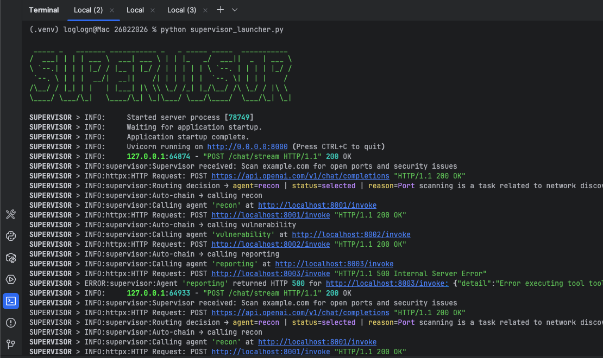
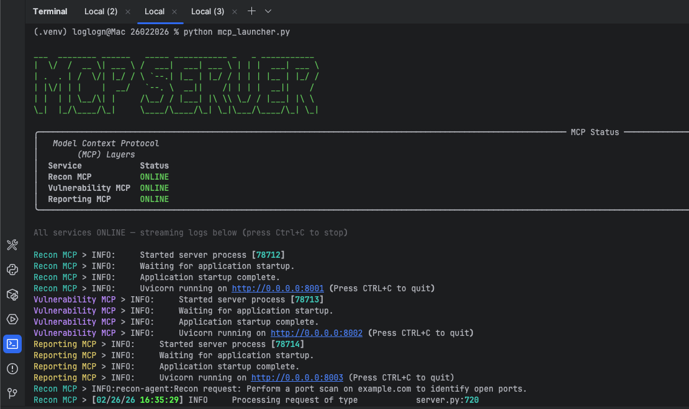
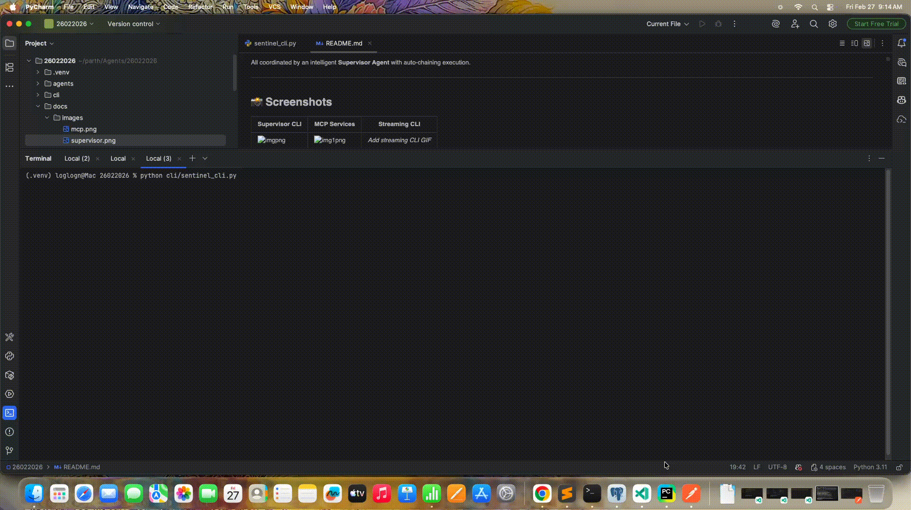

# SentinelAI — Autonomous Security Multi-Agent System

SentinelAI is a production-style **autonomous cybersecurity assistant** built with **LangGraph + MCP + FastAPI**.

It automatically performs:

* Network reconnaissance
* Vulnerability intelligence (real CVE lookup)
* Executive risk reporting

All coordinated by an intelligent **Supervisor Agent** with auto-chaining execution.

---

## 📸 Screenshots

| Supervisor CLI   | MCP Services     | Streaming CLI           |
| ---------------- | ---------------- | ----------------------- |
|  | |  |


---

## 🏗 Architecture Overview

```
User
  ↓
POST /chat or /chat/stream
  ↓
Supervisor (LangGraph)
  ├─ Out of scope → Direct LLM answer
  └─ Security task → Auto-chain execution

Auto-Chain Flow

Recon → Vulnerability → Reporting
```

### Supervisor Decision Matrix

| User Intent          | Execution                         |
| -------------------- | --------------------------------- |
| Recon task           | Recon → Vulnerability → Reporting |
| Vulnerability lookup | Vulnerability → Reporting         |
| Reporting request    | Reporting only                    |
| Non-security query   | Direct Answer (no agents)         |

This avoids unnecessary agent calls and keeps execution efficient.

---

## 🔁 Full Request Flow

```
1. User → POST /chat  (Supervisor :8000)

2. Supervisor:
   - Input validation
   - LLM routing (JSON mode)
   - Decide execution chain

3. Supervisor → Agent /invoke
   Recon → Vulnerability → Reporting

4. Each agent:
   LangGraph → MCP tools

5. Final output returned to user
```

Streaming version (`/chat/stream`) emits real-time events:

```
agent_started
tool_call_started
tool_call_completed
llm_partial
llm_final
error
```

---

## 🤖 Agents

### 1. Recon Agent

External discovery and network context.

**Tools**

* DNS Lookup
* Port Scan (safe limited ports)
* WHOIS Lookup

**Output**

* IP addresses
* Open ports
* Network exposure context

---

### 2. Vulnerability Agent

Maps services/products to known risks.

**Tools**

* CVE Search (real NVD data)

**Output**

* CVE IDs
* CVSS score
* Severity
* Risk explanation

---

### 3. Reporting Agent

Generates executive-level security assessment.

**Tools**

* Risk scoring
* Severity aggregation
* Mitigation planning

**Output**

* Overall risk level
* Issue distribution
* Action plan

---

## 🧩 MCP Microservice Architecture

Each agent runs independently.

| Service           | Port |
| ----------------- | ---- |
| Supervisor API    | 8000 |
| Recon MCP         | 8001 |
| Vulnerability MCP | 8002 |
| Reporting MCP     | 8003 |

Supervisor communicates via HTTP.

---

## 🖥 CLI Interface

SentinelAI includes a **Decepticon-style streaming CLI**:

Features:

* Real-time agent status
* Tool call visualization
* Streaming LLM output
* Rich panels and progress indicators

Run:

```bash
python cli/sentinel_cli.py
```

Example:

```
SentinelAI > Scan example.com

🧠 recon agent
🔧 Port Scan
✓ Tool Result

🧠 vulnerability agent
🔧 CVE Search

🧠 reporting agent
Final Executive Report
```

---

## ⚙️ Tech Stack

* Python 3.11+
* FastAPI
* LangGraph
* OpenAI (GPT-5 / GPT-4o)
* Model Context Protocol (MCP)
* httpx
* Uvicorn
* Pydantic
* Rich (CLI)
* SSE Streaming

Architecture pattern:

* Supervisor Orchestrator
* Tool-driven agents
* MCP microservices
* Streaming-first design

---

## 📁 Project Structure

```
agents/
  supervisor/
  recon/
    mcp_server/
  vulnerability/
    mcp_server/
  reporting/
    mcp_server/

cli/
  sentinel_cli.py

shared/
  config.py
  models.py

supervisor_launcher.py
mcp_launcher.py
```

---

## 🚀 Environment Setup

### 1. Virtual environment

```bash
python -m venv .venv
source .venv/bin/activate
```

### 2. Install

```bash
pip install -r requirements.txt
```

### 3. Create `.env`

```
OPENAI_API_KEY=your_key
OPENAI_MODEL=gpt-5
LOG_LEVEL=INFO

RECON_AGENT_URL=http://localhost:8001
VULN_AGENT_URL=http://localhost:8002
REPORT_AGENT_URL=http://localhost:8003
```

---

## ▶ Running the System

### Start MCP Services

```bash
python mcp_launcher.py
```

Expected:

```
Recon MCP          ONLINE
Vulnerability MCP  ONLINE
Reporting MCP      ONLINE
```

---

### Start Supervisor

```bash
python supervisor_launcher.py
```

---

## 🔌 API Usage

### Standard

```
POST /chat
```

Example:

```bash
curl -X POST http://localhost:8000/chat \
-H "Content-Type: application/json" \
-d '{
  "message": "Scan example.com for open ports and security issues",
  "session_id": "demo"
}'
```

---

### Streaming

```
POST /chat/stream
Accept: text/event-stream
```

---

## 🧪 Example Flows

### Full Scan

Input:

```
Scan example.com for open ports and security issues
```

Execution:

```
Supervisor → Recon → Vulnerability → Reporting
```

---

### CVE Lookup

```
Find vulnerabilities for Apache 2.4.49
```

Execution:

```
Supervisor → Vulnerability → Reporting
```

---

### Non-Security Query

```
Hello
```

Execution:

```
Supervisor → Direct Answer
```

---

## 📊 Observability

Supervisor logs:

```
Routing decision → agent=recon
Auto-chain → calling recon
Auto-chain → calling vulnerability
Auto-chain → calling reporting
```

---

## 🛡 Safety Design

* Defensive security use only
* Safe limited scanning
* No active exploitation
* No intrusive testing

---

## 🎯 Current Capabilities

* Multi-agent orchestration
* Auto-chaining execution
* Real CVE intelligence
* Executive risk reports
* Streaming CLI
* Structured tool logs

---

## 🔮 Future Enhancements

* Service version detection
* Dynamic planner (LLM-decided chains)
* PDF report export
* Web dashboard
* Scan history
* Risk trend analytics

---

Educational and defensive cybersecurity use only.

---

