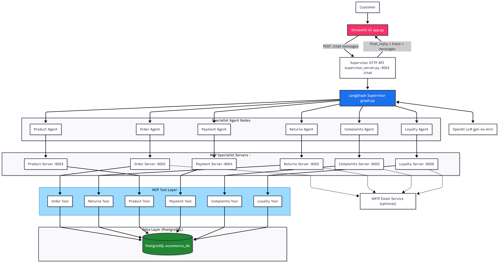
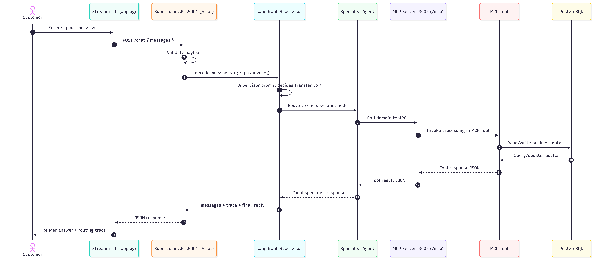

# E-Commerce Support Multi-Agent System

A production-style customer support platform that routes each user request to the right specialist agent (Orders, Returns, Product, Payment, Complaints, Loyalty), backed by MCP tool servers and PostgreSQL.

## Table of Contents
1. [What This Project Does](#what-this-project-does)
2. [Architecture](#architecture)
3. [How a Request Flows](#how-a-request-flows)
4. [Project Structure](#project-structure)
5. [Specialist Servers](#specialist-servers)
6. [Setup](#setup)
7. [Run the System](#run-the-system)
8. [Quick Demo Prompts](#quick-demo-prompts)
9. [Dependency Versions](#dependency-versions)
10. [Operational Notes](#operational-notes)
11. [Troubleshooting](#troubleshooting)

## What This Project Does

This system separates responsibilities into three layers:

1. Experience layer: `Streamlit` chat UI (`app.py`)
2. Orchestration layer: Supervisor API (`supervisor/supervisor_server.py`) + LangGraph routing (`supervisor/graph.py`)
3. Capability layer: six MCP specialist servers (`mcp_servers/*.py`) + PostgreSQL (`database/db.py`) + optional SMTP email (`utils/email_service.py`)

Core behavior:

1. User submits a message in Streamlit.
2. UI sends conversation history to `POST http://127.0.0.1:9001/chat`.
3. Supervisor routes to exactly one specialist.
4. Specialist calls MCP tools in its own domain.
5. UI gets `final_reply`, `trace`, and updated `messages`.

## Architecture

### Runtime Ports

| Service | Port | Endpoint | Role |
|---|---:|---|---|
| Supervisor API | `9001` | `/chat` | Receives UI requests and runs LangGraph routing |
| Order MCP | `8001` | `/mcp` | Order tracking and management |
| Returns MCP | `8002` | `/mcp` | Return eligibility, fraud checks, refunds |
| Product MCP | `8003` | `/mcp` | Product search, stock, pricing |
| Payment MCP | `8004` | `/mcp` | Billing, duplicate charge checks, invoice |
| Complaints MCP | `8005` | `/mcp` | Complaints, escalation, reviews |
| Loyalty MCP | `8006` | `/mcp` | Points, tier, rewards, promotions |

### Diagrams

System architecture:



End-to-end request sequence:



## How a Request Flows

1. `app.py` appends the user input to chat state.
2. `app.py` calls Supervisor `/chat` with message history.
3. `supervisor_server.py` compacts/decodes input to LangChain message objects.
4. `graph.py` runs supervisor routing (fast keyword path + LLM route fallback).
5. Graph transfers control to one specialist agent.
6. Specialist calls domain MCP tools and receives tool output.
7. Supervisor API serializes response and returns:
   - `final_reply`
   - `trace`
   - `messages`
8. Streamlit renders assistant response and trace dropdown.

## Project Structure

```text
ecommerce_support/
|- app.py                         # Streamlit chat UI
|- start_servers.py               # Starts all specialist + supervisor servers
|- requirements.txt               # Python dependencies
|- .env.example
|- supervisor/
|  |- graph.py                    # LangGraph routing + specialist orchestration
|  `- supervisor_server.py        # FastAPI wrapper on port 9001
|- mcp_servers/
|  |- order_server.py             # Port 8001
|  |- returns_server.py           # Port 8002
|  |- product_server.py           # Port 8003
|  |- payment_server.py           # Port 8004
|  |- complaints_server.py        # Port 8005
|  `- loyalty_server.py           # Port 8006
|- database/
|  `- db.py                       # DB creation, schema, seed data
|- utils/
|  `- email_service.py            # Optional SMTP notifications
`- assets/
   |- Chart1.png
   `- Chart2.png
```

## Specialist Servers

| Domain | Main Responsibilities | Example Tools |
|---|---|---|
| Order | Tracking, cancellation, address updates, order history | `get_order_status`, `cancel_order`, `update_shipping_address` |
| Returns | Eligibility, fraud checks, return and refund lifecycle | `check_return_eligibility`, `flag_return_fraud`, `process_refund` |
| Product | Search, availability, price, low stock, restock info | `search_products`, `check_stock_level`, `check_restock_date` |
| Payment | Charges, duplicate detection, invoice, coupon checks | `verify_charge`, `flag_duplicate_charge`, `get_invoice` |
| Complaints | Complaint intake, escalation, replacements, reviews | `submit_complaint`, `escalate_to_human`, `add_review` |
| Loyalty | Points, tiers, redemptions, promo validation | `get_loyalty_points`, `get_tier_status`, `validate_promo_code` |

## Setup

### Prerequisites

1. Python `3.10+`
2. Local PostgreSQL service running
3. OpenAI API key
4. Optional: Gmail app password for email notifications

### Install Dependencies

```powershell
pip install -r requirements.txt
```

### Configure Environment

Create `.env` in project root:

```env
OPENAI_API_KEY=your_openai_api_key_here

DB_HOST=localhost
DB_PORT=5432
DB_NAME=ecommerce_db
DB_USER=postgres
DB_PASSWORD=your_postgres_password

EMAIL_SENDER=youremail@gmail.com
EMAIL_APP_PASSWORD=your_gmail_app_password
```

Minimum required for chat:

1. `OPENAI_API_KEY`
2. Database variables (`DB_HOST`, `DB_PORT`, `DB_NAME`, `DB_USER`, `DB_PASSWORD`)

## Run the System

### 1) Start all backend servers

```powershell
python start_servers.py
```

This launches:

1. Specialist MCP servers on `8001` to `8006`
2. Supervisor API on `9001`

### 2) Start the Streamlit UI

In a second terminal:

```powershell
streamlit run app.py
```

Open the URL printed by Streamlit (usually `http://localhost:8501`).

### 3) Stop everything

Press `Ctrl+C` in the terminal running `start_servers.py`.

## Quick Demo Prompts

Use these prompts in the chat UI:

```text
Where is my order? My email is aarav.sharma@shop.com
I want to return an item from order #1. My email is aarav.sharma@shop.com
Show me all electronics products you have
I think I was charged twice for order #9. My email is anjali.nair@shop.com
Get invoice for order #5. My email is sneha.patel@shop.com
How many loyalty points do I have? My email is sneha.patel@shop.com
```

## Dependency Versions

The following versions are sourced directly from `requirements.txt`:

| Package | Version Spec |
|---|---|
| `langgraph` | `>=0.2.0` |
| `langchain` | `>=0.2.0` |
| `langchain-openai` | `>=0.1.0` |
| `langchain-core` | `>=0.2.0` |
| `langchain-mcp-adapters` | `>=0.1.0` |
| `mcp` | `>=1.0.0` |
| `python-dotenv` | `>=1.0.0` |
| `psycopg2-binary` | `>=2.9.0` |
| `streamlit` | `>=1.35.0` |
| `nest-asyncio` | `>=1.6.0` |
| `uvicorn` | `>=0.30.0` |
| `httpx` | `>=0.27.0` |

## Operational Notes

1. The supervisor only routes. Domain logic is executed by specialist servers.
2. DB initialization is idempotent (`init_db()` is safe across multiple starts).
3. The launcher starts specialists before supervisor to avoid startup race conditions.
4. Email features are optional and fail gracefully if SMTP credentials are missing.

## Troubleshooting

If UI cannot connect to supervisor:

1. Confirm `python start_servers.py` is running.
2. Confirm port `9001` is free and reachable.

If supervisor fails on tool loading:

1. Confirm all specialist ports `8001` to `8006` are up.
2. Confirm dependencies are installed from `requirements.txt`.

If DB errors occur:

1. Confirm PostgreSQL is running.
2. Verify `.env` DB credentials.
3. Verify the DB user has create/connect permissions.

If requests become slow over time:

1. Restart servers with the current launcher (`start_servers.py`) to apply process I/O fixes.
2. Check API key quota and model latency.
