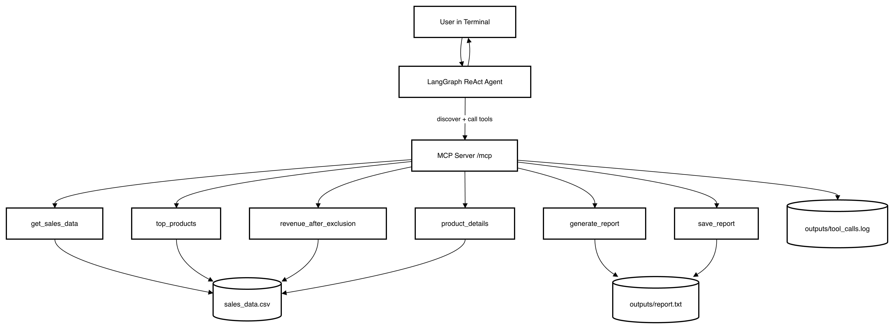

# Smart Data Agent (Strict MCP + Uvicorn + Terminal)

This project uses strict MCP tools registered with `@mcp.tool` and a terminal chat agent powered by OpenAI + LangGraph.

## Architecture Flow



## Folder Structure

```text
app/
  mcp_server.py            # strict MCP tool definitions (@mcp.tool)
  agent/terminal_chat.py   # OpenAI ReAct agent + MCP tool discovery
scripts/
  run_server.py            # start uvicorn server
  run_chat.py              # terminal chat client
outputs/
sales_data.csv
requirements.txt
.env.example
```

## MCP Tools

Defined in `app/mcp_server.py`:
- `get_sales_data(...)`
- `top_products(...)`
- `revenue_after_exclusion(...)`
- `list_groupable_fields(...)`
- `product_details(...)`
- `generate_report(...)`
- `save_report(...)`

If MCP server is down, the agent cannot execute tools (no local fallback).

## Setup

```bash
python3 -m venv .venv
source .venv/bin/activate
pip install -r requirements.txt
cp .env.example .env
# set OPENAI_API_KEY in .env
```

## Run

Start server:

```bash
python3 scripts/run_server.py
```

MCP endpoint:
- `http://127.0.0.1:8000/mcp`

Start terminal chat:

```bash
python3 scripts/run_chat.py
```

## Demo Prompts

- `Give me top 5 product lines by sales.`
- `Show top 10 products by PRODUCTCODE.`
- `Compare top 5 products and write a short executive summary.`
- `If we remove Trucks and Buses from top 5, what is revised revenue?`
- `Generate a report and save it to outputs/monday_report.txt`

## Runtime Behaviors

- Ambiguous ranking prompts trigger clarification:
  - `Do you want ranking by PRODUCTLINE or PRODUCTCODE?`
- Chat keeps short session memory for follow-up questions.
- Every tool call is logged as JSON in `outputs/tool_calls.log` with:
  - `tool`, `args`, `status`, `duration_ms`, and optional `error`.
